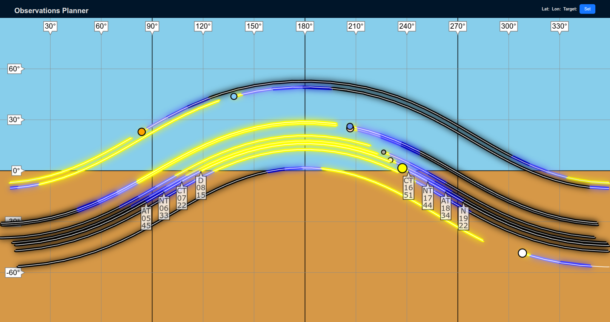
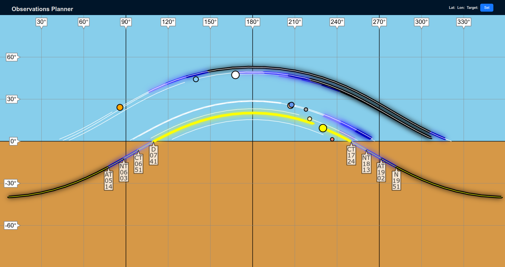

# obs-planning

Graphical astronomical observations planning utility

## Purpose

The idea is to answer the question "is there something intereasting
to observe in a given part of the sky in a specific window of time?"

There are a lot of apps to show the objects in the sky, but finding
something to look at typically requires finding the object and then
scrolling through time and panning the view of the sky to see if
the object can be observed. With this app it's possible to see the
view of the whole sky during a longer time period at once.


In the example screenshot, the current position of the sun and moon are
shown, and the future path in the sky for the next 24 hours for both.

Additionally, the transition times between stages of twilight (civil,
nautical and astronomical) and the day and night are shown. So, just from
the path of the sun it's possible to see which direction the sun rises
from and where it sets and when the different stages of illumination are
happening.

For both the sun and the selected objects the outline of the object
path indicates the illumination of the sky in five stages from full
night to full day, so it's possible to see where the object will be in
the sky in the next 24 hours and when it will be dark enough to
observe it. Basically, if you can see a dark line drawn above the
horizon, the that target object will be visible in the night sky.

Once loaded, the current position of the sun and the target object will
be automatically updated once per minute.

## Versions

### 0.8.0

First version with unlimited observation positions, searches and
search results all stored on the server side database. User accounts,
login and JWT authentication implemented.

### 0.8.1

Implemented different sizes and colors for the planets. Sun and Moon
have astronomically correct sizes except scaled up, planets have colors
and sizes that should make them easily recognizable even without labels.



### 0.8.2

The object paths are now clipped to the observability limits. Also
removed the daytime brightness from other objects than sun to make the
view less busy and to indicate easier when the objects are properly
visible (dark enough).



### 0.9.0

Google Cloud Run deployment support (`make gcp-push`, `make gcp-deploy`,
`make gcp-destroy`). The astro backend base URL is now delivered to the
frontend at runtime via the new unauthenticated `/config` endpoint
(`OBS_ASTRO_URL` env var on the Go server); when unset the frontend
falls back to the previous `//<host>:8081` behavior, so local and AWS
deployments are unchanged.

### 0.10.0

Moon phase indication: the moon's marker tooltip shows the illuminated
percentage and the conventional phase name (e.g. "Waxing gibbous"), and
the moon marker itself is drawn with the correct phase shape, with the
illuminated side oriented toward the sun's position on the sky. The
astro backend's `/api/get-obj` response gains `illumination`, `waxing`
and `bright_limb_angle` fields for the moon target.

## Next steps

- On-hover infobox for the objects

## Architecture

- Frontend: React with Ant Design for the overall layout and Konva for
  the canvas for vector graphics
- Backend: Two separate backend servers, primary one implemented in Go
  running Echo server, secondary implemented in Python running Flask
  and astropy for the astronomical calculations. Purpose of this is to
  keep the primary server responsive even if the secondary is handling
  a lot of heavy calculations and to allow differential resource scaling.
- Running locally with docker compose
- Easy deployment to AWS ECS or Google Cloud Run

# Setup (docker as root, others as user)
- Install AWS CLI and set up SSO
- Install AWS CDK
- Install docker
- Install golang
- Install npm
- Install nvm
- Install node.js: `nvm install 22`
- Install vite: `npm install -D vite`
- Choose database password: `export OBS_DB_PASSWORD=<db-password>`

## Set up venv in astrobackend (required for running unit tests)

```
cd astrobackend
python3 -m venv .astrovenv
source .astrovenv/bin/activate
pip install -r requirements.txt
```

## Set up Vite + React (one-time setup after repo create, just for documentation here)
```
npm create vite@latest
```
For create:
- Project name: obs-ui
- Select a framework: React
- Select a variant: JavaScript
- Use rolldown-vite (Experimental)?: No
- Install with npm and start now?: Yes

## Install JS dependencies (one-time setup after repo clone)
```
cd obs-ui
npm install
```

## Build UI code (locally, optional)
```
cd obs-ui
npm run build
```

## Build backend and astrobackend images for local use (includes UI build)
`make build`
Running the images does this automatically, this can be used if you want
to build the images without running them.

## Run unit tests (sequentially for UI code, Go server and Python server)
`make check`
This is done locally for all three. Could also be done with docker if
the host OS has problems running the application code locally.

## Run backend images using docker compose
`make runserver`

Local development cycle is intended to be: Modify code (whether
JS or either server), Ctrl-C previous `make runserver`, re-run
`make runserver`

UI will be reachable in http://localhost:8080/

## Clean up unused images from docker

Docker doesn't automatically clean up old images once newer ones have
been built and tagged, so this needs to be run every once in a while:
`make docker-cleanup`

## Build and push the latest images to AWS
`make aws-push`

The built images are essentially the same as what `make runserver` 
builds and runs, but this target includes repo creation, image tagging
and pushing to AWS ECR. After this they can be run in AWS using the
following CDK steps.

Repositories are billable resources in AWS so they should to be deleted 
when no longer needed:
`make aws-cleanup`

## Set up CDK (one-time setup in the repo)
```
mkdir obs-ecs
cd obs-ecs
cdk bootstrap
cdk init --language python
source .venv/bin/activate
pip install -r requirements.txt
```

## Init CDK
```
cd obs_ecs
source .venv/bin/activate
```
`aws sso login` if needed

Also may need to unset

`unset AWS_SECRET_ACCESS_KEY AWS_ACCESS_KEY_ID AWS_SESSION_TOKEN` 

as these will interfere with the sso login, whose details are looked up from whe AWS CLI config using `AWS_PROFILE` env variable. 

## Deployment cycle in AWS

Requirements:
- Images need to have been pushed to AWS repositories (`make aws-push`).
- An Aiven Postgres service must exist, and its connection details must be stored in an AWS Secrets Manager secret named `obs-planning/aiven-pg` as a JSON blob. The CDK stack looks this secret up by name and injects each field into the Go container. Create it once with:

```
aws secretsmanager create-secret \
  --name obs-planning/aiven-pg \
  --region eu-north-1 \
  --secret-string '{"host":"<pg-xxx.aivencloud.com>","port":"<Aiven port>","user":"avnadmin","password":"<pwd>","dbname":"defaultdb"}'
```

Values come from the Aiven service overview page. All fields are strings.

```
cd obs_ecs
cdk synth
cdk deploy
cdk destroy
```

## Set up Google Cloud (one-time)

Requires the gcloud CLI, installed and authenticated (`gcloud auth login`).

Create the project and enable the needed services:

```
gcloud projects create <project-id>
```

Link a billing account to the new project in the Cloud console
(Billing -> Link a billing account) before continuing.

```
gcloud config set project <project-id>
gcloud services enable run.googleapis.com artifactregistry.googleapis.com secretmanager.googleapis.com
gcloud artifacts repositories create obs-planner --repository-format docker --location europe-north1
```

The Make targets below use the project configured here; export
`GCP_PROJECT=<project-id>` only if you want to override it (for
example to deploy to a second project without switching the gcloud
default).

(No `gcloud auth configure-docker` needed: `make gcp-push` logs docker
into Artifact Registry with an access token on every push, same as the
ECR login in `aws-push`. The credential-helper route doesn't work with
a snap-installed docker, which can't exec `docker-credential-gcloud`.)

Store the Aiven database password in Secret Manager and allow the
Cloud Run runtime service account to read it:

```
printf '%s' "$OBS_DB_PASSWORD" | gcloud secrets create obs-db-password --data-file=-
gcloud secrets add-iam-policy-binding obs-db-password \
  --role roles/secretmanager.secretAccessor \
  --member "serviceAccount:$(gcloud projects describe $(gcloud config get-value project) --format 'value(projectNumber)')-compute@developer.gserviceaccount.com"
```

Finally, create a `gcp-db.env` file at the repo root (gitignored) with
the non-secret Aiven connection details, from the same Aiven service
overview page the AWS deployment uses:

```
OBS_DB_HOST=<pg-xxx.aivencloud.com>
OBS_DB_PORT=<Aiven port>
OBS_DB_USER=avnadmin
OBS_DB_NAME=defaultdb
```

## Deployment cycle in Google Cloud Run

Requirements: one-time setup above done and `gcp-db.env` present. The
project comes from `gcloud config`; `GCP_PROJECT` overrides it.

Build the UI and both images and push them to Artifact Registry
(on an arm64 host add `--platform linux/amd64` to the docker builds):

`make gcp-push`

Deploy or update both Cloud Run services (astro first — the backend
deploy looks up the astro service URL and passes it as `OBS_ASTRO_URL`,
which the frontend fetches via `/config`):

`make gcp-deploy`

The app is reachable at the obs-backend service URL printed by the
deploy. Both services scale to zero when idle, so the first request
after an idle period has a cold-start delay (largest for the astro
service).

Delete the services when no longer needed:

`make gcp-destroy`

The Artifact Registry repository is billable storage; delete it too
when no longer needed:

`make gcp-cleanup`

## Local postgres setup (optional)

The backend server can be run directly, outside docker, in this case a
postgres instance is required and needs to be configured with
environment variables:

```
export OBS_DB_HOST=<hostname>
export OBS_DB_USER=<db-username>
export OBS_DB_PASSWORD=<db-password>
export OBS_DB_NAME="obs_db"
export OBS_DB_PORT=5432
```

