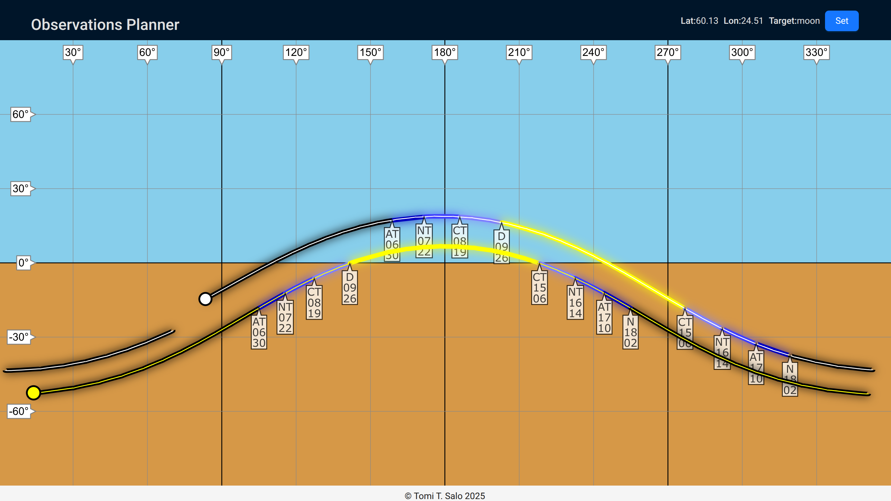

# obs-planning

Graphical astronomical observations planning utility

## Purpose

The idea is to answer the question "is there something intereasting
to observe in a given part of the sky in a specific window of time?"

There are a lot of apps to show the objects in the sky, but finding
something to look at typically requires finding the object and then
scrolling through time and panning the view of the sky to see if
the object can be observed. With this app it's possible to see the
view of the whole sky during a longer time period at once.



In the example screenshot, the current position of the sun and moon are
shown, and the future path in the sky for the next 24 hours for both.

Additionally, the transition times between stages of twilight (civil,
nautical and astronomical) and the day and night are shown. So, just from
the path of the sun it's possible to see which direction the sun rises
from and where it sets and when the different stages of illumination are
happening.

For both the sun and the selected object (limited to just one currently)
the outline of the object path indicates the illumination of the sky in
five stages from full night to full day, so it's possible to see where
the object will be in the sky in the next 24 hours and when it will be
dark enough to observe it.

Once loaded, the current position of the sun and the target object will
be automatically updated once per minute.

# Future roadmap

- Define the observation window (altitude and azimuth limits and time limits)
  highlight when the observation target(s) are in the selected window
- Search for objects based on category and visibility in the selected
  observation window
- User accounts, authentication and persistent user profiles

# Architecture

- Frontend: React with Ant Design for the overall layout and Konva for
  the canvas for vector graphics
- Backend: Two separate backend servers, primary one implemented in Go
  running Echo server, secondary implemented in Python running Flask
  and astropy for the astronomical calculations. Purpose of this is to
  keep the primary server responsive even if the secondary is handling
  a lot of heavy calculations and to allow differential resource scaling.
- Running locally with docker compose
- Easy deployment to AWS ECS

# Setup
- Install AWS CLI and set up SSO
- Install AWS CDK
- Install docker
- Install golang
- Install node.js: `nvm install 22`

# Set up venv in astrobackend

```
cd astrobackend
python3 -m venv .astrovenv
source .astrovenv/bin/activate
pip install -r requirements.txt
```

# Set up React (one-time setup in the repo)
```
cd backend
npm create vite@latest
```

# Build UI code
```
cd ubs-ui
npm run build
```

# Build backend image for local use (includes UI build)
`make build`

# Run unit tests (sequentially for UI code, Go server and Python server)
`make check`

# Run backend images locally
`make runserver`

UI will be reachable in http://localhost:8080/

# Clean up unused images from docker

Docker doesn't automatically clean up old images once newer ones have
been built and tagged, so this needs to be run every once in a while:
`make docker-cleanup`

## Build and push the latest images to AWS
`make aws-push`

Repositories are billable resources in AWS so they should to be deleted 
when no longer needed:
`make aws-cleanup`

# Set up CDK (one-time setup in the repo)
```
mkdir obs-ecs
cd obs-ecs
cdk bootstrap
cdk init --language python
source .venv/bin/activate
pip install -r requirements.txt
```

# Init CDK
```
cd obs_ecs
source .venv/bin/activate
```
`aws sso login` if needed

Also may need to unset

`unset AWS_SECRET_ACCESS_KEY AWS_ACCESS_KEY_ID AWS_SESSION_TOKEN` 

as these will interfere with the sso login, whose details are looked up from whe AWS CLI config using `AWS_PROFILE` env variable. 

# Deployment cycle in AWS

Requirement: images need to have been pushed to AWS repositories

```
cd obs_ecs
cdk synth
cdk deploy
cdk destroy
```
